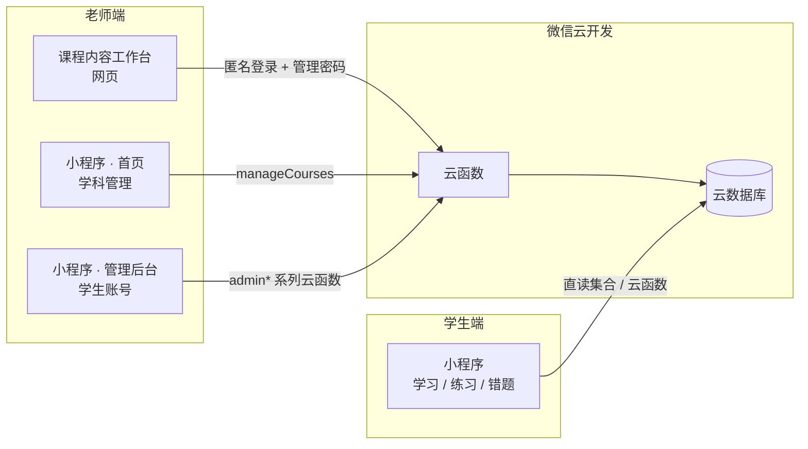

# 少儿编程课程小程序


一个面向中小学生的微信小程序，用于学习 Python、C++ 等编程课程，覆盖「教、学、练、测」完整闭环。配套一个网页版**课程内容工作台**，供老师批量维护课程与题库。

**系统整体架构：**



## 目录

- [功能特性](#功能特性)
- [系统职责边界](#系统职责边界)
- [课程内容工作台](#课程内容工作台)
- [快速开始（部署步骤）](#快速开始部署步骤)
- [数据结构说明](#数据结构说明)
- [主题与样式系统](#主题与样式系统)
- [项目结构](#项目结构)
- [使用说明](#使用说明)
- [注意事项](#注意事项)
- [常见问题](#常见问题)

## 功能特性

### 学生端

| 模块 | 功能 |
| ---- | ---- |
| 账号 | 登录（账号由老师创建发放，无需注册）、修改密码（需验证原密码） |
| 课程 | 浏览学科 → 章节 → 知识点详情（文字讲解 + 代码示例） |
| 练习 | 章节知识点习题 + 等级考试习题，选择题 / 填空题，含完成进度追踪 |
| 错题 | 章节知识点错题 + 等级考试错题，支持逐题移除和批量移除 |
| 其他 | 学习进度、知识点收藏、个人资料（头像、昵称、个性签名） |

### 老师端

| 模块 | 入口 | 功能 |
| ---- | ---- | ---- |
| 学科管理 | 小程序首页 | 新建学科（只填名称，id / 图标 / 颜色自动生成）、改名、删除（级联清理云端内容） |
| 学生账号管理 | 我的 → 管理后台 | 创建账号（姓名 + 用户名 + 初始密码 + 有效期）、续期、一键重置密码（默认 `123456`）、删除（级联清理学习数据）、按状态筛选（全部 / 即将到期 / 已过期） |
| 课程内容维护 | 课程内容工作台（网页） | 章节 / 知识点 / 习题的批量编辑与 AI 辅助生成；**「⚙ 考试类型配置」为各学科配置等级考试的类型与等级**，详见下文 |

> 课程内容的编辑**只在工作台进行**，小程序端不提供内容管理入口，避免双写入口造成数据分叉。

### 账号有效期机制

- 学生账号由老师创建时指定有效期（1 个月 / 3 个月 / 半年 / 1 年，或永久）
- 到期后学生端自动强制退出登录，提示联系老师续期；续期后数据原样恢复
- 老师账号永久有效；未设置有效期字段的老账号也视为永久有效

## 系统职责边界

项目严格区分「学科生命周期」「内容编辑」「账号管理」三个职责域，每个域只有一个入口：

| 操作 | 小程序首页（管理员） | 小程序管理后台 | 课程内容工作台 |
| ---- | :---: | :---: | :---: |
| 学科 新建 / 改名 / 删除 | ✅ | — | ❌ |
| 章节 新建 / 改名 / 删除 | ❌ | ❌ | ✅ |
| 知识点 新建 / 改名 / 删除 | ❌ | ❌ | ✅ |
| 学习题 / 章节题 / 考试题 编辑 | ❌ | ❌ | ✅ |
| 学生账号 创建 / 续期 / 重置密码 / 删除 | ❌ | ✅ | ❌ |

- 学科数据以云端 `courses` 集合为**唯一真源**，所有页面启动时自动从云端水合
- 内置学科 `python` / `cpp` 带 `builtin: true` 标记，**不可删除、不可改名**（考试类型配置仍可编辑）
- 等级考试的**类型与等级列表**是学科级配置（`courses` 文档的 `examConfig` 字段），在工作台题目页「⚙ 考试类型配置」维护；内置学科缺省时回落默认配置，新建学科默认无考试类型
- 删除学科时级联清理其全部云端内容（章节、知识点、三类题目、学习进度、错题、收藏）

## 课程内容工作台

除了小程序本身，仓库还包含一个给老师用的**网页版课程维护工具**（`content-workbench/`），解决小程序端逐题手填效率低的问题。

### 核心能力

- **三级结构**：学科 / 章节 / 知识点，手动增删改，也可粘贴素材让 AI 生成
- **三段速记**：每个知识点分「概念 / 特征 / 易混淆」维护，附代码示例
- **三类题目**：
  - 学习题（内嵌于知识点 `lessons.questions`）、章节题（`chapterQuestions`），随知识点 / 章节存在
  - 考试题（`examQuestions`）：独立实体，按「学科 → 考试类型 → 级别」分类维护，**类型与等级列表来自学科的 `examConfig` 配置**（在工作台「⚙ 考试类型配置」维护）
- **素材输入**：粘贴文本 / 拖入 Word / 上传 TXT，支持批量导入题库
- **AI 辅助**：网页 AI 整理素材 → 本地 Ollama 模型结构化转换 → 人工校对
- **云端同步**：结构、题目分两步同步，幂等写入，带管理密码鉴权

### 技术架构

- 前端：纯 HTML / CSS / JS，托管在微信云开发「静态网站托管」
- 本地模型：Ollama 运行 `qwen3:4b`，免费、离线、隐私数据不出本机
- 云函数：`importContent`（写入）、`getCourseTree`（读取）、`manageCourses`（考试类型配置写入），均带 `ADMIN_PASSWORD` 密码校验

部署方式与小程序端不同，单独见 [`content-workbench/DEPLOYMENT.md`](content-workbench/DEPLOYMENT.md)，含完整分步说明和踩坑记录。

## 快速开始（部署步骤）

### 第一步：准备微信小程序账号

1. 访问 [mp.weixin.qq.com](https://mp.weixin.qq.com) 注册小程序
2. 记录下你的 **AppID**

> ✅ 完成标志：拿到 AppID。

### 第二步：开通云开发

1. 用微信开发者工具打开本项目
2. 点击左上角 **「云开发」** → **「开通」**，创建一个云环境
3. 记录下 **云环境 ID**

> ✅ 完成标志：拿到云环境 ID。

### 第三步：配置项目

1. 复制 `project.config.template.json` 为 `project.config.json`，填入 AppID（若已有 `project.config.json`，替换其中的 `appid` 字段即可）
2. 复制 `env.template.js` 为 `env.local.js`，填入云环境 ID

> ✅ 完成标志：开发者工具能正常编译，无缺配置报错。

### 第四步：创建数据库集合

在云开发控制台 → 数据库 → 点击 **「+」** 添加以下集合：

| 集合名称 | 说明 |
| ---- | ---- |
| `courses` | 学科注册表（学科唯一真源） |
| `users` | 用户信息（含账号、密码、角色、有效期） |
| `chapters` | 课程章节 |
| `lessons` | 知识点内容 |
| `progress` | 学习进度记录 |
| `favorites` | 用户收藏记录 |
| `chapterQuestions` | 章节知识点习题 |
| `examQuestions` | 等级考试习题 |
| `wrongQuestions` | 错题本记录 |
| `exerciseProgress` | 章节知识点习题练习进度 |

### 第五步：设置数据库权限

对每个集合点击 **「权限设置」**：

- 其余集合统一选 **「所有用户可读，仅创建者可读写」**
- `courses` 集合同理（小程序端直读依赖「所有用户可读」；写操作全部走 `manageCourses` 云函数）

> ✅ 完成标志：10 个集合全部创建且权限已设置。

### 第六步：创建老师（管理员）账号

本系统没有注册功能，第一个管理员需要手动在数据库创建。

在云开发控制台 → 数据库 → `users` → 添加记录：

```json
{
  "username": "admin",
  "password": "jhjj438",
  "nickname": "老师",
  "role": "admin",
  "status": "approved",
  "createdAt": "2026-01-01T00:00:00.000Z"
}
```

> `password` 是 `admin123` 的哈希值。保存后即可用 **admin / admin123** 登录，登录后请尽快在「我的 → 修改密码」中改掉。

如需自定义初始密码，用 Node 计算哈希后填入 `password` 字段：

```bash
node -e "const h=(s)=>{let x=0;for(let i=0;i<s.length;i++){x=(x<<5)-x+s.charCodeAt(i);x&=0x7FFFFFFF}return x.toString(36)+s.length};console.log(h('你的密码'))"
```

> ✅ 完成标志：能用 admin 账号登录小程序。

### 第七步：上传并部署云函数

1. 在微信开发者工具左侧 **「云函数」** 目录
2. 右键每个云函数 → **「上传并部署：云端安装依赖」**
3. 等待所有云函数部署完成

> 💡 所有云函数只依赖 `wx-server-sdk`，直接用「云端安装依赖」上传即可，无需本地 npm install。
> 💡 `manageCourses`、`getCourseTree`、`importContent` 也一并部署（后两者是工作台用的，工作台部署详见其专属文档）。
> ⚠️ 给**工作台**调用的云函数（`getCourseTree` / `importContent` / `manageCourses`）部署完还有两件事：
> ① 云函数「权限控制」里为它们单独放行（`"invoke": true`，否则网页调用报 `PERMISSION_DENIED`）；
> ② 每个函数单独配置 `ADMIN_PASSWORD` 环境变量（同一密码值，缺了会报「缺少操作者身份」）。

> ✅ 完成标志：云函数列表全部显示部署成功。

### 第八步：初始化内置学科与示例内容

**8.1 内置学科入库（必须）**

小程序首页的学科列表来自 `courses` 集合。两种方式任选其一：

- **方式 A**：执行一次 `initCourses`（云开发控制台 → 云函数 → 云端测试，传参 `{ "confirm": true }`），它会把 `python` / `cpp` 两门内置学科写入 `courses` 集合（`builtin: true`），并灌入示例章节 / 知识点；
- **方式 B**：线上已有真实内容时**不要重跑 `initCourses`**（它会先清空再重建示例内容！），直接在 `courses` 集合手动添加两条文档：

```json
{ "_id": "python", "name": "Python", "icon": "i-code", "color": "#45B0E0", "order": 1, "builtin": true }
{ "_id": "cpp", "name": "C++", "icon": "i-chip", "color": "#4E6EF2", "order": 2, "builtin": true }
```

> ⚠️ `_id` 必须是 `python` / `cpp`（自定义 id，不要用自动生成的），所有存量数据都按这个 id 关联。

**8.2 示例题库（可选）**

同样方式执行 `initQuestions`（依赖 8.1 的方式 A 先执行），一键灌入三套示例习题。

> ✅ 完成标志：小程序首页能看到 Python / C++ 两张课程卡。

### 第九步：测试

1. 点击开发者工具的 **「编译」** 按钮，用 admin / admin123 登录
2. 首页作为管理员：新建一门测试学科 → 改名 → 删除，确认全流程可用
3. 「我的 → 管理后台」创建学生账号（姓名、用户名、密码、有效期）
4. 用学生账号登录，浏览课程、做题、收藏
5. 打开工作台网页（部署见 [DEPLOYMENT.md](content-workbench/DEPLOYMENT.md)），维护章节内容与习题
6. 测试学生账号到期后的强制退出效果（可在管理后台续期恢复）

> ✅ 完成标志：以上流程全部跑通。

## 数据结构说明

### 集合关系总览

按职责域分三组，外键关系一览：

| 集合 | 归属域 | 关联字段 | 说明 |
| ---- | ---- | ---- | ---- |
| `courses` | 内容域 | — | 学科注册表（唯一真源） |
| `chapters` | 内容域 | `courseId` → `courses._id` | 章节 |
| `lessons` | 内容域 | `chapterId` → `chapters._id` | 知识点（内嵌学习题） |
| `chapterQuestions` | 内容域 | `courseId` / `chapterId` / `lessonId` | 章节题（按知识点一条文档） |
| `examQuestions` | 内容域 | `courseId`（**独立实体**，不挂章节/知识点） | 考试题（按「类型 + 级别」一条文档） |
| `users` | 用户域 | — | 账号（学生 / 管理员） |
| `progress` | 学习行为域 | `userId` → `users._id`，`courseId` | 最近学习位置（每课程一条） |
| `favorites` | 学习行为域 | `userId`，`lessonId` → `lessons._id` | 知识点收藏 |
| `wrongQuestions` | 学习行为域 | `userId`，`courseId` | 错题本 |
| `exerciseProgress` | 学习行为域 | `userId`，`lessonId` | 习题完成进度（每知识点一条） |

> **级联规则**：删除学科时，云端会级联清理其 `chapters`、`lessons`、`chapterQuestions`、`examQuestions`、`progress`、`wrongQuestions`、`favorites` 全部数据；删除学生账号时，级联清理其 `progress`、`favorites`、`wrongQuestions`。

### 学科 (courses)

| 字段 | 类型 | 必填 | 说明 | 关联 |
| ---- | ---- | :---: | ---- | ---- |
| `_id` | string | ✅ | 学科 id（名称 slug 化，如 `python`、`scratch`），创建后不可改 | 被各集合 `courseId` 引用 |
| `name` | string | ✅ | 显示名称 | — |
| `icon` | string | ✅ | 图标 class（默认 `i-book`，白色变体自动加 `-w`） | — |
| `color` | string | ✅ | 主题色（卡片渐变基色，如 `#45B0E0`） | — |
| `order` | number | ✅ | 排序序号（小者靠前，新建自动 `max + 1`） | — |
| `builtin` | boolean | ✅ | 内置保护标记（`true` = 不可删除、不可改名） | — |
| `examConfig` | array | — | 等级考试类型配置（在工作台题目页「⚙ 考试类型配置」维护）。每项：`{ type, name, desc, icon, color, colorDark, levels[] }`，`type` 关联 `examQuestions.examType`，`levels` 决定考试页展示的等级。缺省时内置学科回落默认配置，其他学科视为未配置（考试页显示空态） | — |
| `createdAt` | date | ✅ | 创建时间 | — |

### 章节 (chapters)

| 字段 | 类型 | 必填 | 说明 | 关联 |
| ---- | ---- | :---: | ---- | ---- |
| `_id` | string | ✅ | 系统自动生成 | 被 `lessons.chapterId` 引用 |
| `courseId` | string | ✅ | 所属学科 id | → `courses._id` |
| `title` | string | ✅ | 章节标题 | — |
| `order` | number | ✅ | 排序序号（数字小的靠前） | — |
| `createdAt` | number | ✅ | 创建时间戳 | — |

### 知识点 (lessons)

| 字段 | 类型 | 必填 | 说明 | 关联 |
| ---- | ---- | :---: | ---- | ---- |
| `_id` | string | ✅ | 系统自动生成 | 被 `favorites.lessonId`、`chapterQuestions.lessonId` 等引用 |
| `chapterId` | string | ✅ | 所属章节 id | → `chapters._id` |
| `title` | string | ✅ | 知识点标题 | — |
| `content` | string | ✅ | 文字讲解内容 | — |
| `codeExample` | string | — | 代码示例 | — |
| `order` | number | ✅ | 排序序号 | — |
| `questions` | array | — | 学习题数组（内嵌在知识点下的题目） | — |

### 题目格式 (questions 字段)

所有题目（学习题 / 章节题 / 考试题 / 错题快照）共用同一 JSON 结构，支持选择题和填空题：

```json
[
  {
    "type": "choice",
    "question": "Python 是什么类型的编程语言？",
    "options": {
      "A": "编译型",
      "B": "解释型",
      "C": "机器语言",
      "D": "汇编语言"
    },
    "answer": "B",
    "explanation": "Python 是解释型语言，代码在运行时逐行解释执行。"
  },
  {
    "type": "fill",
    "question": "在 Python 中，使用____关键字来定义函数。",
    "answer": "def",
    "explanation": "def 是 define 的缩写，用于定义函数。"
  }
]
```

### 用户 (users)

| 字段 | 类型 | 必填 | 说明 | 关联 |
| ---- | ---- | :---: | ---- | ---- |
| `_id` | string | ✅ | 系统自动生成 | 被各学习行为集合 `userId` 引用 |
| `username` | string | ✅ | 登录用户名（字母 / 数字 / 下划线，至少 3 位），创建后不可改 | — |
| `password` | string | ✅ | 简单哈希后的密码（自研弱哈希，改密 / 重置必须复用同一函数） | — |
| `name` | string | ✅ | 真实姓名（管理员创建时填写） | — |
| `nickname` | string | — | 昵称 | — |
| `avatar` | string | — | 头像云存储路径 | — |
| `signature` | string | — | 个性签名 | — |
| `role` | string | ✅ | 角色：`'admin'` / `'user'` | — |
| `status` | string | ✅ | 状态：`'approved'`（新账号由管理员创建，直接生效） | — |
| `validUntil` | date | — | 有效期截止时间（无此字段 = 永久有效） | — |
| `createdAt` | date | ✅ | 创建时间 | — |
| `updatedAt` | date | — | 最后更新时间 | — |

### 学习进度 (progress)

每学生每课程仅一条记录（Upsert 模式），记录「上次学到」的位置：

| 字段 | 类型 | 必填 | 说明 | 关联 |
| ---- | ---- | :---: | ---- | ---- |
| `_id` | string | ✅ | 系统自动生成 | — |
| `userId` | string | ✅ | 用户 id | → `users._id` |
| `courseId` | string | ✅ | 学科 id | → `courses._id` |
| `chapterId` | string | ✅ | 当前所在章节 id | → `chapters._id` |
| `lessonId` | string | ✅ | 当前所在知识点 id | → `lessons._id` |
| `updatedAt` | date | ✅ | 最后更新时间 | — |

### 收藏 (favorites)

| 字段 | 类型 | 必填 | 说明 | 关联 |
| ---- | ---- | :---: | ---- | ---- |
| `_id` | string | ✅ | 系统自动生成 | — |
| `userId` | string | ✅ | 用户 id | → `users._id` |
| `lessonId` | string | ✅ | 收藏的知识点 id（**不含 courseId**，级联删除需先收集 lessonId） | → `lessons._id` |
| `createdAt` | date | ✅ | 收藏时间 | — |

### 章节知识点习题 (chapterQuestions)

每知识点一条文档，题目存于 `questions` 数组：

| 字段 | 类型 | 必填 | 说明 | 关联 |
| ---- | ---- | :---: | ---- | ---- |
| `_id` | string | ✅ | 系统自动生成 | — |
| `courseId` | string | ✅ | 学科 id | → `courses._id` |
| `chapterId` | string | ✅ | 章节 id | → `chapters._id` |
| `lessonId` | string | ✅ | 知识点 id | → `lessons._id` |
| `questions` | array | ✅ | 题目数组（见上方题目格式） | — |
| `updatedAt` | date | — | 最后更新时间 | — |

### 等级考试习题 (examQuestions)

**独立实体**：不挂在章节 / 知识点下，删学科 / 章节 / 知识点不会连带产生丢失问题，按「考试类型 + 级别」一条文档：

| 字段 | 类型 | 必填 | 说明 | 关联 |
| ---- | ---- | :---: | ---- | ---- |
| `_id` | string | ✅ | 系统自动生成 | — |
| `courseId` | string | ✅ | 学科 id | → `courses._id` |
| `examType` | string | ✅ | 考试类型标识，**取值来自所属学科 `examConfig` 里配置的 `type`**（内置学科默认 `CIE` / `GESP` / `CSP-JS`） | — |
| `level` | string | ✅ | 等级名称（一级~十级、CSP-J 入门级 / 提高级等） | — |
| `questions` | array | ✅ | 题目数组（见上方题目格式） | — |
| `updatedAt` | date | — | 最后更新时间 | — |

### 错题本 (wrongQuestions)

每道错题一条文档，快照保存题目详情：

| 字段 | 类型 | 必填 | 说明 | 关联 |
| ---- | ---- | :---: | ---- | ---- |
| `_id` | string | ✅ | 系统自动生成 | — |
| `userId` | string | ✅ | 用户 id | → `users._id` |
| `courseId` | string | ✅ | 学科 id | → `courses._id` |
| `chapterId` | string | — | 章节 id（章节错题时有值） | → `chapters._id` |
| `lessonId` | string | — | 知识点 id（章节错题时有值） | → `lessons._id` |
| `examType` | string | — | 考试类型（考试错题时有值） | — |
| `level` | string | — | 等级名称（考试错题时有值） | — |
| `questionKey` | string | ✅ | 题目唯一标识（题目关键字段序列化） | — |
| `question` | object | ✅ | 题目详情快照（含 `type` / `question` / `options` / `answer` 等） | — |
| `wrongCount` | number | ✅ | 做错次数 | — |
| `firstWrongAt` | date | ✅ | 首次做错时间 | — |
| `lastWrongAt` | date | ✅ | 最近做错时间 | — |
| `mastered` | boolean | ✅ | 是否已掌握（`true` 则移出错题本） | — |
| `createdAt` | date | ✅ | 创建时间 | — |
| `updatedAt` | date | — | 最后更新时间 | — |

### 练习进度 (exerciseProgress)

追踪学生章节知识点习题的完成情况，每学生每知识点仅一条记录（Upsert 模式，保留历史最佳成绩）：

| 字段 | 类型 | 必填 | 说明 | 关联 |
| ---- | ---- | :---: | ---- | ---- |
| `_id` | string | ✅ | 系统自动生成 | — |
| `userId` | string | ✅ | 用户 id | → `users._id` |
| `courseId` | string | ✅ | 学科 id | → `courses._id` |
| `chapterId` | string | ✅ | 章节 id | → `chapters._id` |
| `lessonId` | string | ✅ | 知识点 id | → `lessons._id` |
| `totalQuestions` | number | ✅ | 该知识点习题总数 | — |
| `correctCount` | number | ✅ | 最佳正确题数 | — |
| `attemptCount` | number | ✅ | 练习次数 | — |
| `lastAttemptAt` | date | — | 最近练习时间 | — |
| `createdAt` | date | ✅ | 创建时间 | — |
| `updatedAt` | date | — | 最后更新时间 | — |

## 主题与样式系统

项目使用统一的**设计变量（Design Tokens）**管理视觉样式，主题为「星空靛蓝」。

### 设计变量（定义在 `app.wxss`）

| 变量 | 值 | 用途 |
| ---- | ---- | ---- |
| `--primary` | `#5B67F1` | 主色（按钮、链接、选中态） |
| `--primary-deep` | `#8E5CF6` | 渐变端色（紫色） |
| `--tint` | `#EDEFFF` | 主色淡背景（标签、选中底色） |
| `--ok` / `--ok-tint` | `#22C08A` / `#E5F8F1` | 成功（答题正确） |
| `--danger` / `--danger-tint` | `#FF5C72` / `#FFEDEF` | 危险（答题错误、删除） |
| `--warning` / `--warning-tint` | `#FFA940` / `#FFF4E6` | 警告（提示） |
| `--bg` / `--panel` / `--panel-2` | `#F6F7FB` / `#fff` / `#F1F2F8` | 页面背景 / 卡片 / 次级背景 |
| `--t1` / `--t2` / `--t3` | `#252A3D` / `#5A6072` / `#9AA0B0` | 一 / 二 / 三级文字 |
| `--line` | `#E7E9F2` | 分割线、描边 |
| `--r-lg` / `--r-md` | `24rpx` / `20rpx` | 卡片 / 按钮圆角 |

**换主题只需修改 `app.wxss` 中的变量定义**（以及 `app.json` 的导航栏、tabBar 颜色），页面样式全部引用变量。

### 图标系统（`styles/icons.wxss`）

- 全部图标为统一风格的**线性 SVG**（2px 圆角描边），以 base64 内嵌于 `styles/icons.wxss`
- 用法：`<text class="icon i-book"/>`，大小跟随容器 `font-size`（图标为 1em 见方）
- 彩色 / 渐变背景上使用白色变体：`<text class="icon i-book-w"/>`
- 图标源码在 `tools/gen-icons.js`，**新增或修改图标后运行 `node tools/gen-icons.js` 重新生成**
- tabBar 图标为 PNG（微信要求），位于 `assets/tabbar/`，同为线性风格
- 课程卡片主题色来自 `courses` 集合的 `color` 字段（渐变背景），图标用白色变体

### 样式规范

- 页面样式**不要硬编码颜色**，一律使用 `var(--xxx)` 变量
- 新增语义色时先在 `app.wxss` 定义变量，再在页面引用
- ⚠️ 避免在页面里复用全局类名（如 `.progress-bar`）做其他用途，全局定义会与页面样式冲突

## 项目结构

```text
c_young_learn/
├── app.js                    # 小程序入口（含学科列表云端水合 loadCourses）
├── app.json                  # 小程序全局配置
├── app.wxss                  # 全局样式 + 设计变量定义
├── env.template.js           # 云环境配置模板（复制为 env.local.js）
├── styles/
│   └── icons.wxss            # 图标库（由 tools/gen-icons.js 生成）
├── assets/
│   └── tabbar/               # tabBar 图标 PNG
├── tools/
│   └── gen-icons.js          # 图标库生成脚本
├── utils/
│   └── db.js                 # 数据库操作工具（含学科 registry 方法）
├── pages/
│   ├── login/                # 登录页
│   ├── change-password/      # 修改密码页
│   ├── index/                # 首页：课程入口 + 管理员学科管理（新建/改名/删除）
│   ├── chapters/             # 章节列表页（空学科显示「内容准备中」）
│   ├── lesson/               # 知识点详情页
│   ├── profile/              # 个人中心页
│   ├── profile-edit/         # 编辑资料页
│   ├── progress/             # 习题页（TabBar，课程 tab 动态渲染）
│   ├── favorites/            # 错题页（TabBar，课程 tab 动态渲染）
│   ├── study-progress/       # 学习进度页
│   ├── my-favorites/         # 我的收藏页
│   ├── chapter-exercises/    # 学生端-章节习题列表（含进度）
│   ├── lesson-exercises/     # 学生端-知识点习题列表（含完成状态）
│   ├── exercise-practice/    # 学生端-习题练习页
│   ├── chapter-wrong/        # 学生端-章节知识点错题章节列表
│   ├── wrong-lesson/         # 学生端-章节知识点错题知识点列表
│   ├── wrong-practice/       # 学生端-错题练习页（章节/考试复用）
│   ├── exam-exercises/       # 学生端-等级考试类型选择
│   ├── exam-levels/          # 学生端-等级考试等级列表
│   ├── exam-practice/        # 学生端-等级考试练习页
│   ├── exam-wrong/           # 学生端-等级考试错题类型选择
│   ├── exam-wrong-levels/    # 学生端-等级考试错题等级列表
│   ├── admin/                # 管理后台（仅学生账号管理；课程内容统一在 content-workbench 维护）
│   └── admin-student-edit/   # 学生账号创建/编辑（续期/重置密码）
└── cloudfunctions/           # 云函数目录
    ├── userLogin/            # 登录（含有效期校验）
    ├── changePassword/       # 修改密码
    ├── manageCourses/        # 学科管理（新建/改名/删除/考试类型配置 setExamConfig，删除级联清理）
    ├── adminCreateUser/      # 管理员创建学生账号
    ├── adminListUsers/       # 管理员获取学生列表
    ├── adminUpdateValidity/  # 管理员给学生账号续期
    ├── adminResetPassword/   # 管理员重置学生密码
    ├── adminDeleteUser/      # 管理员删除学生（级联清理数据）
    ├── cleanPendingUsers/    # 一次性清理旧版遗留的待审核账号
    ├── updateUserProfile/    # 更新用户资料
    ├── updateProgress/       # 更新学习进度
    ├── getFavorites/         # 获取收藏列表
    ├── toggleFavorite/       # 切换收藏状态
    ├── chapterQuestions/     # 章节知识点习题
    ├── examQuestions/        # 等级考试习题（含 getTypesWithQuestions 兜底聚合）
    ├── wrongQuestions/       # 错题本 + 练习进度
    ├── initCourses/          # 初始化内置学科 + 示例课程内容（幂等，先清后建）
    ├── initQuestions/        # 初始化示例题库（一次性）
    ├── getCourseTree/        # 课程树读取（工作台用，带管理密码）
    └── importContent/        # 结构与题目写入（工作台用，带管理密码）
```

## 使用说明

### 老师操作流程

1. 登录老师账号
2. **学科管理**（小程序首页）：管理员可见「＋ 新建学科」卡片，每张非内置学科卡片带「✎ 改名 / ✕ 删除」角标。内置学科 Python / C++ 受保护，不显示角标
3. **学生账号管理**（我的 → 管理后台）：创建账号、续期、重置密码（重置后为 `123456`）、删除、按状态筛选
4. **内容维护**（工作台网页）：编辑章节 / 知识点 / 习题，分「同步结构与内容」和「同步题目」两步写入云端
5. **考试类型配置**（工作台网页 → 题目页 → 考试题 → ⚙）：为每门学科增删等级考试类型、编辑等级列表，保存即上云，小程序考试页随之生效

> 删除学科会级联清理该学科的全部云端内容（章节、习题、学生错题与收藏），操作前有二次确认。

### 学生做题流程

#### 章节知识点习题（习题 Tab → 章节知识点习题卡片）

```text
章节列表（显示题目总数和已完成题数/进度条）
  └── 知识点列表（显示题目数 + 完成状态：未开始/练习中/已完成）
        └── 习题练习页 → 提交后自动保存进度和错题
```

#### 等级考试习题（习题 Tab → 等级考试习题卡片）

```text
考试类型选择（来自学科的 examConfig 配置，未配置的学科显示引导空态）
  └── 等级列表（来自 examConfig 的 levels，显示各等级题目数）
        └── 等级考试练习页 → 提交后自动保存错题
```

#### 错题本（错题 Tab）

```text
错题入口
  ├── 章节知识点错题
  │     └── 有错题的章节列表
  │           └── 有错题的知识点列表
  │                 └── 错题练习页（逐题练习，支持单独移除和全部移除）
  └── 等级考试错题
        └── 有错题的考试类型（按实际错题聚合，名称 / 颜色取自学科 examConfig）
              └── 有错题的等级列表
                    └── 错题练习页（逐题练习，支持单独移除和全部移除）
```

### 等级考试说明

等级考试的**类型与等级不再是写死的**，而是每门学科的配置（`courses.examConfig`）。下表为内置学科的**默认配置**（工作台「⚙ 考试类型配置」里可随时增删改，保存即生效、无需发版）：

| 学科 | CIE 等级 | GESP 等级 | CSP-J/S |
| ---- | ---- | ---- | ---- |
| Python | 1-6 级 | 1-8 级 | — |
| C++ | 1-10 级 | 1-8 级 | 入门级 / 提高级 |

> 新建学科（如 Scratch）默认**没有任何考试类型**：老师在工作台「⚙ 考试类型配置」里为它添加类型（如 SIE）和等级后，小程序考试页才出现对应卡片。

### 添加内容建议

- **学科**：小程序首页管理员端直接「＋ 新建学科」，只填名称即可，无需改代码
- **章节**：按课程结构组织，如 Python 可分为「变量与数据类型」「控制流」「函数」「列表与字典」「文件操作」等
- **知识点**：每个章节下多个知识点，包含讲解、代码示例和练习题，建议在工作台用 AI 辅助批量生成后人工校对
- **题目**：每 2-3 个知识点配 1-2 道练习题；知识点习题作为课后作业，等级考试习题用于备考练习
- **学生账号**：按班级 / 课时售卖时，用有效期控制使用期限（如一期课 90 天），到期可在管理后台续期

## 注意事项

1. **安全**：当前密码加密方式较简单，正式使用时建议使用更安全的加密方式（如 bcrypt）
2. **权限**：管理员操作云函数的权限校验依赖前端传入 operatorId，属软校验；严格方案应绑定微信 openid
3. **数据备份**：定期在云开发控制台导出重要数据
4. **性能**：如果课程内容很多，考虑添加分页或搜索功能
5. **课程扩展**：新学科在小程序首页管理员端创建即可（写入云端 `courses` 集合），所有页面自动适配，**无需修改任何代码**
6. **内置学科保护**：`python` / `cpp` 带 `builtin` 标记，不可删除、不可改名；前端不显示操作入口，云函数端也有校验兜底
7. **`_id` 不可变**：学科的 `_id`（如 `cpp`）被所有存量数据引用，云端手动操作时切勿修改
8. **云函数部署**：新增或修改过的云函数需要重新上传部署
9. **样式**：页面样式避免复用 `app.wxss` 全局类名（如 `.progress-bar`），以免被全局定义覆盖

## 常见问题

**Q: 登录时提示「学生不存在」**

- A: 账号由老师在后台创建，请先联系老师创建账号

**Q: 学生账号到期了怎么办**

- A: 老师在「我的 → 管理后台」找到该学生，点击续期（按天数续期或指定截止日期）；续期后学生的全部学习数据原样恢复

**Q: 学生忘记密码**

- A: 老师在管理后台点击「重置密码」，重置后为默认密码 `123456`，学生登录后再自行修改

**Q: 如何添加新学科（如 Scratch）**

- A: 管理员在小程序首页点击「＋ 新建学科」，只填名称即可。新建后所有页面（首页、习题、错题等）自动出现该学科，工作台「从云端拉取」也会同步显示。**等级考试需要再到工作台「⚙ 考试类型配置」为它配好类型和等级**，考试页才会出卡片；未配置时考试页显示引导空态，不会冒出别的学科的考试类型

**Q: 工作台保存考试类型配置报 PERMISSION_DENIED / 缺少操作者身份**

- A: 前者是云函数「权限控制」没放行网页调用——在云函数权限控制 JSON 里为 `manageCourses` 加 `"invoke": true`；后者是该函数没配 `ADMIN_PASSWORD` 环境变量——在云开发控制台 → 云函数 → manageCourses → 配置 → 环境变量里补上（与 `importContent` 同值）。给工作台用的云函数都要做这两步配置

**Q: 点击按钮没反应**

- A: 检查是否已正确部署所有云函数，以及云环境 ID 是否配置正确

**Q: 内容保存后不显示**

- A: 检查 `courseId` 是否与 `courses` 集合中的学科 `_id` 匹配，并刷新页面

**Q: 习题保存失败**

- A: 检查 `chapterQuestions` / `examQuestions` 集合是否已创建，相关云函数是否已部署

**Q: 头像上传失败**

- A: 检查云存储是否已开通，以及云存储权限是否设置正确

**Q: 等级考试错题页面看不到错题**

- A: 确认已重新部署 `wrongQuestions` 云函数；之前产生的旧错题可能缺少 `examType` / `level` 字段，重新做一次等级考试题目即可正常显示

**Q: 章节习题完成进度不更新**

- A: 确认已创建 `exerciseProgress` 集合，并确保 `wrongQuestions` 云函数已重新部署

**Q: 如何创建第二个老师账号**

- A: 云开发控制台 → 数据库 → `users` 集合 → 参照「部署步骤第六步」添加一条 `role` 为 `'admin'` 的记录

**Q: 老版本升级后，历史遗留的待审核账号怎么清理**

- A: 部署 `cleanPendingUsers` 云函数并云端测试执行一次，会删除所有 `status` 为 `'pending'` 的旧账号

## 作者

路宽 —— 少儿编程老师，专注 Python / C++ 启蒙教学，独立开发者。

- GitHub：https://github.com/blk2002
- 邮箱：2875902295@qq.com
- 微信：blk20020

使用中遇到问题，欢迎通过以上方式联系交流。

## 许可证

本项目仅供学习和教学使用。

---

祝使用愉快！🎉
