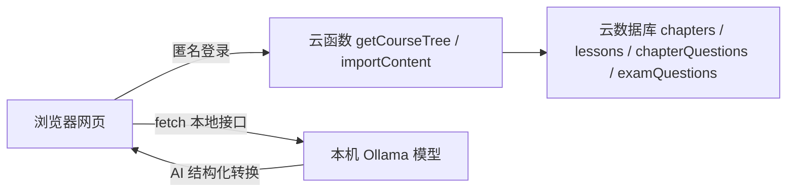

# 内容工作台部署指南

这份文档面向第一次拿到本仓库的人：跟着做一遍，就能把「课程内容工作台」跑起来，用于维护学科章节、知识点和题目，并同步到微信小程序云数据库。

文档里所有 `<尖括号>` 内容都是需要你自己填的占位符，不含任何个人账号信息。

## 这套工具是什么

工作台由四个部分拼成一条链路：



- 网页托管在微信云开发的静态网站托管，得到一个正式网址。
- 素材转成三段速记、题目结构化，靠本机 Ollama 本地模型（免费、离线、隐私数据不出本机）。
- 网页用匿名登录调用两个云函数：`getCourseTree` 读取课程树，`importContent` 写入结构和题目。两个函数内部都用 `ADMIN_PASSWORD` 环境变量做管理密码校验。

## 部署前准备

- 一个已开通云开发的微信小程序项目，以及对应的微信开发者工具。
- 一台 Windows 电脑，本地模型跑在这台机器上，日常使用时要开机并启动模型。
- 浏览器推荐 Chrome 或 Edge。

## 第一步 部署云函数

### 1.1 上传两个云函数

1. 用微信开发者工具打开小程序项目。
2. 在编辑器文件树里展开 `cloudfunctions`，找到 `importContent` 和 `getCourseTree` 两个目录。
3. 分别右键每个目录，选择「上传并部署：云端安装依赖」，等它完成。

> 这两个云函数必须在同一个云环境里，且和后面网页要连的环境一致。

### 1.2 配置管理密码

1. 进入云开发控制台，找到「云函数」列表。
2. 点进 `importContent`，切到「配置」，找到「环境变量」，添加一行：
   - 变量名：`ADMIN_PASSWORD`
   - 变量值：`<你的管理密码>`
3. 对 `getCourseTree` 重复同样的配置，两个函数的 `ADMIN_PASSWORD` 要设成同一个值。
4. 顺手把两个函数的「执行超时」从默认的 3 秒改到 60 秒，避免写入批量数据时被中断。

记好这个密码，网页里同步和拉取都要用到。

## 第二步 安装本地模型

### 2.1 安装 Ollama

从 ollama.com 下载 Windows 安装包，双击一路 Install 即可。程序本体很小，默认装在 C 盘，这一步不需要纠结路径。

> 安装器不提供「选择安装路径」的选项，这是正常现象。真正占空间的是模型文件，下一步会把它放到 D 盘。
>
> 如果安装过程中进度条长时间停在 0 B/s，是安装器在从境外服务器下载程序文件、国内直连慢。可以改用魔搭（modelscope.cn）搜索 Ollama 的国内安装包，或用浏览器、下载工具重新下载安装包。

### 2.2 把模型存到 D 盘

打开 PowerShell（以管理员身份运行），执行：

```powershell
setx OLLAMA_MODELS "D:\ollama\models"
```

这条命令让后续下载的模型都落在 `D:\ollama\models`，不占 C 盘。

如果电脑上已经打开过 Ollama 桌面应用，需要在它的设置页里把 Model location 也改成 `D:\ollama\models`——桌面应用的设置优先级高于环境变量，两者都改最稳妥。同时把设置里的 Cloud 开关关掉，否则会优先连 ollama.com 的云端模型而不是本机模型。

### 2.3 允许网页跨域访问（关键）

网页是 https 地址，要访问本机的 `http://127.0.0.1:11434`，必须让 Ollama 放行跨域，否则会报 403。在同一个 PowerShell 里再执行：

```powershell
setx OLLAMA_ORIGINS "*"
```

改完后完全退出 Ollama（托盘图标右键 → Quit），再重新打开，让两个环境变量生效。

### 2.4 拉取模型

新开一个 PowerShell 窗口，执行：

```powershell
ollama pull qwen3:4b
```

模型约 2.5GB，视网速需要几分钟到十几分钟。国内网络如果下载慢，可以先执行 `setx OLLAMA_HF_MIRROR "https://modelscope.cn"` 再拉取，让它走魔搭镜像加速。

### 2.5 启动脚本

仓库里 `content-workbench/启动本地模型.bat` 就是启动脚本，它会带上跨域和模型目录参数后台启动 Ollama。把它复制到任意顺手的目录（比如 `D:\ollama\`），每次使用前双击运行，看到 `qwen3:4b` 出现在模型列表里即可。

> 日常使用时，启动脚本对应的 Ollama 服务窗口要一直开着，关掉服务就停了。判断标准是网页顶部的「本地模型」指示灯是否变绿。

## 第三步 部署网页

### 3.1 开通静态托管

微信开发者工具 → 云开发控制台 → 找到「静态网站托管」→ 开通（选免费额度即可）。

### 3.2 上传文件

1. 进入静态托管的「文件管理」，回到根目录 `/`。
2. 点「上传文件」，选中 `content-workbench` 目录里的这些内容：
   - `index.html`（必须在根目录，不能套一层文件夹）
   - `css/` 文件夹
   - `js/` 文件夹
   - `README.md`、`docs/` 可选
3. 不要上传 `启动本地模型.bat` 和 `tests/`，前者是本机脚本，后者是单元测试。

上传完成后，在「网站配置」里找到默认域名（形如 `https://<你的环境ID>-<appid>.tcloudbaseapp.com`），收藏它，这就是工作台网址。

## 第四步 配置云端权限

这一步最容易卡住，三件事都要做。

### 4.1 开启匿名登录

匿名登录入口**在网页版控制台，不在微信开发者工具里**。浏览器打开 `https://tcb.cloud.tencent.com/`，登录时选「微信公众号」扫码（这样才能看到小程序里的那个云环境），然后：

1. 左上角确认选中了你的环境。
2. 左侧菜单进入「身份认证 → 登录方式」。
3. 把「匿名登录」打开。

### 4.2 确认安全域名

进入「环境配置 → 安全来源」页面（直达链接 `https://tcb.cloud.tencent.com/dev?#/env/safety-source`）。静态托管域名通常已经在默认白名单里（系统会预置 `env-id.tcloudbaseapp.com` 这一条）。如果列表里没有你的完整域名，就点「添加域名」补上。

### 4.3 配置云函数调用权限（关键）

云函数默认的安全规则会拒绝匿名用户调用，直接使用会报 `PERMISSION_DENIED`。在「云函数」列表页点「权限控制」，把安全规则配置成下面这样：

```json
{
  "*": {
    "invoke": "auth != null && auth.loginType != 'ANONYMOUS'"
  },
  "getCourseTree": {
    "invoke": true
  },
  "importContent": {
    "invoke": true
  }
}
```

含义是：其他所有云函数保持「拒绝匿名用户」的默认保护，只对这两个工作台函数放行匿名调用。放行是安全的，因为它们内部还有 `ADMIN_PASSWORD` 校验，没有密码做不了任何写操作。

## 第五步 验证连通

1. 先双击 `启动本地模型.bat`，确保本地模型服务在跑。
2. 打开工作台网址，强制刷新一次（Ctrl+Shift+R）。
3. 看页面顶部两个指示灯：本地模型、云端都应变成绿色。
4. 点「从云端拉取」，输入管理密码，能返回数据就说明整条链路通了。

## 日常使用

- 新建课程结构：左侧树点「+ 学科」「+ 章节」逐级建，右侧编辑知识点内容，最后「同步结构与内容」。
- 补知识点：选中知识点，粘贴素材，选「填空模式」让本地 AI 填入。
- 导入题目：切到「② 题目」页签，粘贴题目素材或手动加题，逐题校对后「同步题目」。
- 每次用本地 AI 之前，都要先启动本地模型脚本。

## 常见问题

- 安装 Ollama 时进度条卡在 0 B/s：安装器在从境外服务器下载程序文件，国内直连慢。改用魔搭（modelscope.cn）搜索 Ollama 国内安装包，或用浏览器、下载工具重新下载安装包。
- 模型下载到了 C 盘而不是 D 盘：`OLLAMA_MODELS` 设晚了或没生效。先看 Ollama 桌面应用设置里的 Model location 是否指向 D 盘，再确认执行 `setx OLLAMA_MODELS "D:\ollama\models"` 之后完全重启过 Ollama。
- 网页打开是 404：`index.html` 没放在托管根目录，重新上传到 `/` 下，不要套一层文件夹。
- 云端指示灯不绿，控制台报 `cloudbase is not defined`：网页里 CloudBase SDK 没加载，检查网络，或确认 `index.html` 里 SDK 地址是 `https://static.cloudbase.net/cloudbase-js-sdk/2.17.3/cloudbase.full.js`。
- 拉取报 `PERMISSION_DENIED`：回到第四步 4.3，确认云函数安全规则已放行 `getCourseTree`、`importContent` 两个函数。
- 本地模型指示灯不绿：先确认启动了脚本，再执行 `curl.exe http://127.0.0.1:11434/api/tags` 看能否返回模型列表；如果带 Origin 头的请求返回 403，说明 `OLLAMA_ORIGINS` 没生效，回到第二步 2.3。
- 模型下载慢或失败：设置 `OLLAMA_HF_MIRROR` 走魔搭镜像，见第二步 2.4。
- 本地模型在跑，却用上了云端模型：Ollama 桌面应用的 Cloud 开关没关，把它关掉。

## 作者

路宽，少儿编程老师，专注 Python / C++ 启蒙教学，独立开发者。

- GitHub：https://github.com/blk2002
- 邮箱：2875902295@qq.com
- 微信：blk20020

使用中遇到问题，欢迎通过以上方式联系交流。
