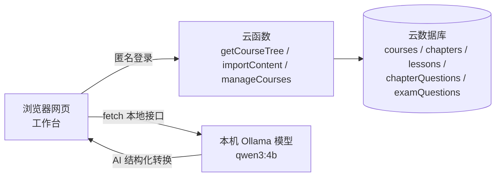

# 课程内容工作台

给少儿编程老师的网页版课程维护工具：在电脑上建立学科章节、知识点速记与三类题目（学习题 / 章节题 / 考试题），支持 AI 辅助生成与手动编辑，一键同步到微信小程序云数据库。


## 目录

- [整体架构](#整体架构)
- [适合谁](#适合谁)
- [核心概念](#核心概念)
- [职责边界](#职责边界)
- [快速部署](#快速部署)
- [日常使用](#日常使用)
- [题目页：学习题与考试题](#题目页学习题与考试题)
- [常见问题](#常见问题)
- [自定义指南](#自定义指南)
- [目录结构](#目录结构)

## 整体架构



- 网页托管在微信云开发「静态网站托管」，得到正式网址，天然满足 Web 安全域名
- 素材格式转换用本机 Ollama 本地模型（免费、离线、隐私数据不出本机），网上找的素材可先用免费网页 AI（豆包 / Kimi）整理成模板文本
- 网页匿名登录调用三个云函数：`importContent` 写入、`getCourseTree` 读取、`manageCourses` 写入考试类型配置，均带 `ADMIN_PASSWORD` 管理密码校验

## 适合谁

- 使用微信小程序云开发（云数据库）承载课程与题库的老师
- 想批量维护课程内容、不想在手机端逐题手填的老师
- 想免费（不依赖付费云端 API）、可复刻分享给其他老师的人

## 核心概念

### 三级结构与三类题目

| 层级 | 存储 | 说明 |
| ---- | ---- | ---- |
| 学科 | `courses` 集合（云端 registry） | 唯一真源，工作台「从云端拉取」自动合并；文档里的 `examConfig` 字段存该学科的**等级考试类型配置** |
| 章节 | `chapters` 集合 | 挂在学科下 |
| 知识点 | `lessons` 集合 | 三段速记（概念 / 特征 / 易混淆）+ 代码示例 |
| 学习题 | `lessons.questions`（内嵌） | 随知识点存在 |
| 章节题 | `chapterQuestions` 集合 | 随章节 / 知识点存在 |
| 考试题 | `examQuestions` 集合 | **独立实体**，按「学科 → 考试类型 → 级别」分类，类型取值来自学科 `examConfig` |

### 本地草稿与云端

- 所有编辑（学科树、章节、知识点、题目、待同步队列）都存在**浏览器 localStorage** 里，即「本地草稿」；云端只是同步目标
- **导出备份 / 导入备份**是草稿的「存档读档」：导出把草稿整体存为 JSON 文件，导入则**整体覆盖**当前草稿（不是合并，导入前先导出留底）
- 已同步到云端的内容不怕浏览器缓存被清（重新「从云端拉取」即可），备份真正保护的是**尚未同步的本地编辑**

## 职责边界

学科的「新建 / 删除 / 改名」由管理员在**小程序首页**完成（写入云端 `courses` 集合）；工作台**只编辑内容**——章节 / 知识点 / 习题，以及**各学科的等级考试类型配置**（「⚙ 考试类型配置」，保存即经 `manageCourses.setExamConfig` 上云）。点「从云端拉取」会把云端学科 registry 合并进左侧学科列表（含小程序端新建的空学科及其 examConfig）。

**内置学科**（写死在 `js/state.js` 的 `BUILTIN_COURSES`，每次 `load()` 兜底补齐，只补空壳不动已有内容）：

| 学科 | id | 图标 | 主题色 | 保护规则 |
| ---- | ---- | ---- | ---- | ---- |
| Python | `python` | `i-code` | `#45B0E0` | 不可删除、不可改名 |
| C++ | `cpp` | `i-chip` | `#4E6EF2` | 不可删除、不可改名 |

> **重要约定**：考试题是独立实体，**删除章节 / 知识点不会连带删除考试题**；考试题按「学科 · 考试类型 · 级别」独立管理与同步。

## 快速部署

完整分步说明见 [`DEPLOYMENT.md`](DEPLOYMENT.md)，这里列关键步骤和容易踩的坑：

1. 安装 Ollama：[ollama.com](https://ollama.com) 下载 Windows 版，程序默认装 C 盘即可（安装器不支持选路径）
2. 模型存 D 盘：`setx OLLAMA_MODELS "D:\ollama\models"`
3. 允许网页跨域：`setx OLLAMA_ORIGINS "*"`（漏掉这步，网页访问本地模型会报 403）
4. 拉取模型：`ollama pull qwen3:4b`（约 2.5GB；国内慢则先 `setx OLLAMA_HF_MIRROR "https://modelscope.cn"`）
5. 微信开发者工具里右键 `importContent`、`getCourseTree`、`manageCourses` → 上传并部署，三个函数都配 `ADMIN_PASSWORD` 环境变量（同一值）
6. 开通静态托管，把 `index.html` + `css/` + `js/` 上传到根目录，收藏网址（只传运行必需文件，不含 `tests/`、`docs/`、`*.md`、`*.bat`）
7. 网页版控制台（tcb.cloud.tencent.com，选微信公众号登录）→ 身份认证 → 登录方式 → 开启匿名登录
8. 云函数「权限控制」里给 `getCourseTree`、`importContent`、`manageCourses` 单独放行匿名调用（否则报 `PERMISSION_DENIED`）
9. 双击 `启动本地模型.bat` 启动本地模型，打开网址，两盏灯变绿即就绪

## 日常使用

| 流程 | 场景 | 步骤 |
| ---- | ---- | ---- |
| A · 新建课程结构 | 从零建一门课的章节与知识点 | 点「帮助」→ 复制「给网页 AI 的指令」→ 和教程一起发给豆包 / Kimi 得素材 → 回工作台粘贴或拖入 Word / TXT →「开始 AI 整理」→ 逐点校对三段速记 →「同步结构与内容」 |
| B · 补单个知识点 | 给已有知识点补内容 | 左侧选中知识点 → 粘贴素材 → 选「填空模式」→ AI 填入当前知识点 |
| C · 导入题目 | 批量录入或 AI 生成题目 | 切「题目」页签，见下节「题目页」 |
| D · 纯手动维护 | 不用 AI，直接编辑 | 点「从云端拉取」→ 树上增删改、编辑内容、手动加题 → 两步同步 |

> 学科本身（新建 / 删除 / 改名）在小程序首页管理员端操作，工作台内没有学科级增删改入口。

## 题目页：学习题与考试题

题目页顶部有分段开关，分两个子视图：

- **学习题 / 章节题**：挂在知识点（`lessons.questions`）和章节（`chapterQuestions`）下，随知识点 / 章节存在
- **考试题**：独立实体，按「学科 → 考试类型 → 级别」分类管理

> **考试类型与等级列表是学科级配置**：题目页「⚙ 考试类型配置」按学科维护（类型标识 / 显示名称 / 描述 / 图标 / 颜色 / 等级列表），保存即写入云端 `courses` 集合的 `examConfig` 字段，小程序端的考试页卡片与等级列表随之生效。内置学科 Python / C++ 缺配置时回落默认值（CIE / GESP / CSP-J/S）；**新建学科默认没有任何考试类型**，需要先在这里配好，小程序考试页才会出卡片。

### 两种 AI 出题方式

| | 基于本知识点现编 | AI 按本分类生成 |
| ---- | ---- | ---- |
| 适用视图 | 学习题 / 章节题 | 考试题 |
| 素材来源 | 当前知识点的三段速记（概念 / 特征 / 易混淆） | **不需要素材**，用「学科 + 考试类型 + 级别」作语境 |
| 前提 | 必须选中知识点且三段填完 | 只要选中左侧分类卡 |
| 数量档位 | 2 / 3 / 5 道 | 2 / 3 / 5 / 8 道 |
| 产出 | 挂到该知识点下 | 塞进选中的分类组 |

> 两种都走**本地模型**（Ollama），使用前先双击 `启动本地模型.bat`。AI 生成的题必须人工逐题校对后再「同步题目」。

### 素材粘贴 vs AI 生成

- **粘贴素材 →「解析入表」**：解析入表按格式收题，素材里有几道进几道，自动按【学习题】/【章节题】/【考试题】标记归类，不限制数量
- **AI 生成**：由数量下拉框控制一次生成几道

### 考试题子视图操作

- 左侧按学科分组列出「考试类型 · 级别」分类卡，显示题量，可「＋ 加题」或「清空」
- **已配置未建题的分类**以虚线幽灵卡显示（标「未建题」）：在「学科」筛选里选中具体学科后可见，**点击即创建该分类**，直接开始加题；「全部学科」视图只在底部提示条数，避免内置学科的 20+ 个等级刷屏
- **手动加一道**：选学科 + 考试类型 + 级别，逐题录入（类型 / 级别选项来自该学科的 examConfig，旧数据出现过的值自动并入兜底）
- **AI 按本分类生成**：见上表，本地模型按分类语境现编
- 右侧为质量检查区，实时显示分类内的题目数与异常
- 考试题独立于学科存在：即使某学科内容被删空，其考试题仍可见、可单独删除与同步

## 常见问题

部署与连通类问题见 [`DEPLOYMENT.md`](DEPLOYMENT.md) 末尾的「常见问题」；使用类问题见工具内「帮助」面板，或 `docs/` 目录。

**Q：改了代码重新上传，页面还是旧的 / 没变化？**

A：静态托管 CDN 对 `.js` / `.css` 默认缓存 365 天。两种办法：① 上传后在静态托管控制台点「刷新」一键清缓存；② 每次更新把 `index.html` 里所有 `?v=` 版本戳 +1（如 `20260910i` → `20260910j`）再上传。推荐做法二，链接带版本戳最稳。

**Q：删除学科后，它名下的考试题去哪了？**

A：考试题是独立实体，不随学科删除。同步题目时这些「孤儿组」仍会参与同步（按 `courseId` 关联），可在题目页单独删除或重新同步。

**Q：保存考试类型配置报 `PERMISSION_DENIED`？**

A：`manageCourses` 的云函数权限没放行网页调用——云函数「权限控制」JSON 里为它加 `"invoke": true`，等 1~3 分钟生效。

**Q：保存考试类型配置报「缺少操作者身份」？**

A：`manageCourses` 没配管理密码——云开发控制台 → 云函数 → manageCourses → 配置 → 环境变量，添加 `ADMIN_PASSWORD`（与 `importContent` 同值）；个别情况需重新部署一次才生效。

## 自定义指南

- 云环境 ID：改 `js/cloud.js` 里的 `ENV` 常量
- 默认本地模型：改 `js/ollama.js`、`js/ai-flow.js` 里的 `qwen3:4b`
- 新学科：管理员在小程序首页「新建学科」创建，工作台「从云端拉取」自动出现，无需改代码

## 目录结构

```text
content-workbench/
├─ index.html            # 工作台页面入口（内含 js/css 版本戳，更新时需 bump）
├─ css/
│  └─ style.css          # 样式（含考试题分栏等样式）
├─ js/                   # 前端模块
│  ├─ state.js           # 本地状态（localStorage 持久化，含 BUILTIN_COURSES）
│  ├─ parser.js          # 素材解析
│  ├─ ai-flow.js         # AI 整理流程
│  ├─ validate.js        # 题目校验（含题干 + 答案哈希）
│  ├─ ollama.js          # 本地模型调用
│  ├─ cloud.js           # 云函数调用（ENV 常量、学科 registry 读取在此）
│  ├─ tree-ui.js         # 结构与内容 UI（仅章节/知识点级增删改）
│  ├─ content-ui.js      # 知识点内容 UI
│  ├─ quiz-ui.js         # 题目 UI（学习题/章节题 + 考试题分栏 + 考试类型配置编辑器）
│  ├─ sync.js            # 同步逻辑（结构/题目，含删除意图队列、学科 registry 合并）
│  ├─ help.js            # 帮助面板
│  └─ app.js             # 启动入口
├─ tests/                # node --test 单元测试（本地验证用，不部署）
├─ docs/                 # 素材模板、网页 AI 指令（文档，不部署）
├─ DEPLOYMENT.md         # 部署指南（含踩坑记录）
├─ README.md
└─ 启动本地模型.bat       # 设跨域参数 + 后台启动 Ollama（模型存 D 盘）

（云函数 importContent / getCourseTree / manageCourses 位于仓库根的 cloudfunctions/ 目录，不在此目录下）
```

## 作者

路宽，少儿编程老师，专注 Python / C++ 启蒙教学，独立开发者。

- GitHub：https://github.com/blk2002
- 邮箱：2875902295@qq.com
- 微信：blk20020

使用中遇到问题，欢迎通过以上方式联系交流。
